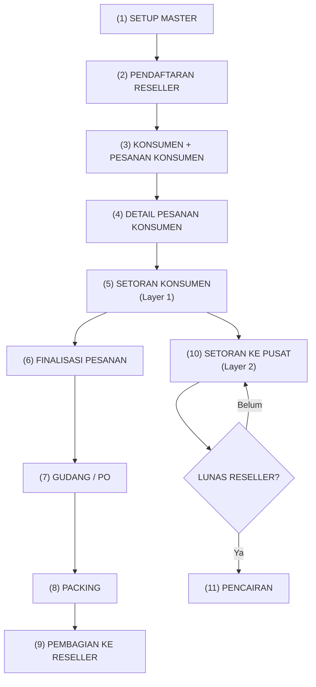

# Data Flow — Paket Lebaran Mumpuni
## Alur Data dari Awal sampai Akhir (2-Layer Setoran, Per Periode)

---

## Amandemen Alur Pesanan Konsumen

Dokumen ini mengikuti `docs/product/program_workflow.md`, yang sekarang menjadi source of truth untuk
workflow `pesanan_konsumen`.

Alur utama sekarang:

```txt
Konsumen
-> Pesanan Konsumen
-> Detail Pesanan Konsumen
-> Setoran Konsumen
-> Finalisasi Pesanan Konsumen
-> Gudang / PO
-> Packing
-> Pembagian Paket ke Reseller
-> Setoran Pusat
-> Pencairan
```

Makna baru:

- `pesanan_konsumen` adalah header tagihan/cicilan konsumen dalam satu periode.
- `detail_pesanan_konsumen` menjadi sumber target tagihan.
- `setoran_konsumen` masuk ke `pesanan_konsumen`.
- `tanggal_final` menandai pesanan siap dipakai operasional gudang.
- penyesuaian budget dilakukan dengan mengubah detail pesanan, bukan membuat layer program terpisah.

---

## Diagram Alur Utama



---

## (1) Setup Master Data & Periode

**Siapa:** Admin  
**Kapan:** Awal musim Lebaran

| Langkah | Tabel | Data yang diinput |
|---|---|---|
| Buat periode | `periode` | nama, tgl_mulai, tgl_selesai |
| Input/duplikat paket | `paket` + `detail_paket` | kode, harga, BOM per periode |
| Atur komisi | `komisi_config` | threshold, persen per kategori |
| Input barang | `barang` + `barang_periode` | stok/harga per periode |
| Setup kas | `akun_kas` | jenis, saldo awal |

---

## (2) Pendaftaran Reseller

**Siapa:** Reseller atau Admin sesuai keputusan onboarding

```txt
Reseller terdaftar
-> status awal PENDING
-> admin approve
-> status AKTIF
```

Reseller `PENDING` tidak bisa input:

- konsumen
- pesanan konsumen
- setoran
- setor pusat

---

## (3) Konsumen + Pesanan Konsumen

**Siapa:** Reseller aktif  
**Kapan:** Saat konsumen mulai memesan paket

```txt
INPUT:
- pilih / buat konsumen
- pilih satu atau beberapa paket
- buat pesanan_konsumen
- buat detail_pesanan_konsumen
```

Write:

- `konsumen`
- `pesanan_konsumen`
- `detail_pesanan_konsumen`

Dampak langsung:

- `target_tagihan_snapshot` pesanan terbentuk
- konsumen siap menerima setoran

---

## (4) Detail Pesanan Konsumen

**Siapa:** Reseller aktif, atau admin untuk koreksi terkontrol

Detail pesanan adalah daftar paket yang sedang dihitung untuk tagihan konsumen.

Status item:

- `AKTIF`
- `TERHENTI`
- `BATAL`

Aturan hitung target:

```txt
target_berjalan =
  SUM(detail_pesanan_konsumen yang masih dihitung)

AKTIF    -> nilai penuh
TERHENTI -> uang_terhenti
BATAL    -> 0
```

Jika konsumen tidak sanggup menutup seluruh target:

- item yang masih masuk budget tetap `AKTIF`
- item yang tidak masuk budget bisa `TERHENTI`
- item yang batal total menjadi `BATAL`

---

## (5) Setoran Konsumen (Layer 1: Konsumen -> Reseller)

**Siapa:** Reseller  
**Kapan:** Setiap kali konsumen membayar cicilan

```txt
INPUT:
- tanggal
- pesanan_konsumen_id
- nominal
- metode
- keterangan
```

Boundary:

```txt
buat_setoran_konsumen
```

Validasi:

```txt
SUM(setoran_konsumen per pesanan) + nominal <= target_berjalan pesanan
```

Dampak:

- `total_bayar_konsumen` bertambah
- `sisa_bayar_konsumen` berkurang
- `total_dikumpulkan` reseller bertambah

Formula:

```txt
total_bayar_konsumen = SUM(setoran_konsumen WHERE pesanan_konsumen_id = :id)
sisa_bayar_konsumen  = target_berjalan - total_bayar_konsumen
status_lunas         = jika sisa = 0 maka LUNAS, selain itu BELUM
```

---

## (6) Finalisasi Pesanan Konsumen

**Siapa:** Reseller aktif atau Admin  
**Kapan:** Saat pesanan siap menjadi dasar operasional gudang

```txt
INPUT:
- pesanan_konsumen_id
- catatan finalisasi opsional
```

Boundary:

```txt
finalisasi_pesanan_konsumen
```

Validasi:

1. periode harus `AKTIF`
2. pesanan harus punya minimal satu item yang masih dihitung
3. target berjalan tidak boleh lebih kecil dari total setoran yang sudah masuk

Write:

- isi `pesanan_konsumen.tanggal_final`
- tulis `audit_log`

Setelah ini:

- pesanan dianggap siap dipakai modul gudang, pengiriman, dan pembagian
- perubahan item menjadi lebih ketat dan wajib diaudit

---

## (7) Gudang / PO

**Siapa:** Admin  
**Sumber data:** `pesanan_konsumen` yang sudah final + `detail_pesanan_konsumen`

Dampak:

- kebutuhan barang dihitung dari item pesanan yang masih dihitung
- item `BATAL` tidak masuk kebutuhan
- item `TERHENTI` mengikuti nilai/aturan operasional yang disetujui

---

## (8) Packing

**Siapa:** Tim Packing  
**Kapan:** Setelah barang tersedia

Packing hanya menyentuh paket yang memang perlu packing.

```txt
INPUT: tanggal, paket, jumlah
-> kurangi stok barang sesuai BOM
-> tambah stok paket jadi
```

---

## (9) Pembagian Paket ke Reseller

**Siapa:** Admin / tim pusat  
**Kapan:** Setelah pesanan final dan stok siap

```txt
INPUT: periode, reseller, daftar detail pesanan
-> buat batch pembagian
-> serahkan
-> audit
```

Aturan:

- detail pesanan yang sudah masuk pembagian selesai tidak boleh dibagikan ulang
- semua selisih dicatat lewat koreksi pembagian

---

## (10) Setoran ke Pusat (Layer 2: Reseller -> Pusat)

**Siapa:** Reseller / Admin sesuai flow verifikasi

```txt
INPUT:
- tanggal
- nominal
- akun_kas_id
- metode
- keterangan
```

Boundary:

```txt
buat_setoran_pusat
```

Validasi:

1. total setor pusat tidak boleh melebihi `nilai_akhir_paket`
2. total setor pusat tidak boleh melebihi `total_dikumpulkan`

Dampak:

- saldo akun kas pusat bertambah
- `total_disetor_pusat` reseller bertambah
- `saldo_belum_disetor` reseller berkurang

---

## (11) Pencairan

**Siapa:** Admin  
**Kapan:** Setelah reseller lunas

Jenis:

- `TABUNGAN`
- `KOMISI`

Validasi:

- nominal tidak boleh melebihi sisa hak reseller
- transaksi harus tercatat per periode

---

## Ringkasan Dampak per Aksi

| Aksi | Target Tagihan | Setoran Konsumen | Saldo Reseller | Saldo Kas | Stok | Audit |
|---|---|---|---|---|---|---|
| Buat pesanan | terbentuk | - | - | - | - | ya |
| Ubah detail pesanan | bisa naik/turun | - | - | - | - | ya |
| Setoran konsumen | - | bertambah | bertambah | - | - | ya |
| Finalisasi pesanan | dibekukan untuk operasional | - | - | - | - | ya |
| Gudang / packing | - | - | - | - | berubah | ya |
| Setor pusat | - | - | berkurang | bertambah | - | ya |
| Pencairan | - | - | - | berkurang | - | ya |

---

## Hasil Review Final Tahap Ini

| Area | Status | Catatan |
|---|---|---|
| Model induk transaksi konsumen | OK | `pesanan_konsumen` menjadi header tunggal |
| Detail item paket | OK | memakai `detail_pesanan_konsumen` |
| Layer setoran | OK | tetap dua layer |
| Finalisasi operasional | OK | memakai `tanggal_final` |
| Penyesuaian budget | OK | dilakukan lewat perubahan detail dan status `TERHENTI` |
| Dokumen turunan | PENDING | schema, contract, query, dan module plan perlu ikut diselaraskan |
