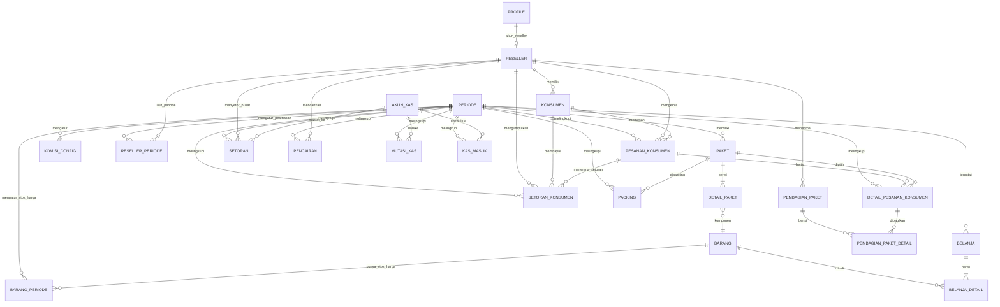

# Schema Mapping: Excel -> Database Profesional
## Paket Lebaran Mumpuni — Sistem Tabungan Berjangka

---

## Inti Bisnis

> **Pesanan Konsumen dengan Cicilan (2-Layer, Per Periode).**
> Setiap musim Lebaran = 1 **periode**.
> Konsumen memilih satu atau beberapa paket sejak awal.
> Reseller membuat **pesanan_konsumen** sebagai header tagihan/cicilan.
> Detail paket disimpan di **detail_pesanan_konsumen**.
> Setoran konsumen masuk ke header pesanan.
> Jika budget berubah, item pesanan bisa disesuaikan.
> Jika tidak tuntas, item tertentu bisa menjadi `TERHENTI`.
> Pesanan difinalkan saat siap masuk alur gudang.
> Reseller menyetorkan uang yang terkumpul ke pusat.

> [!IMPORTANT]
> Semua transaksi yang memengaruhi item, uang, stok, komisi, atau pencairan wajib membawa
> `periode_id` secara eksplisit agar data lintas periode tidak tercampur.

Aturan scope query wajib:

```txt
Semua formula transaksi:
  WHERE periode_id = :periode_id

Jika menghitung nilai item, komisi, poin, tabungan, stok, target, atau kebutuhan:
  AND status_item != 'BATAL'
```

Referensi alur bisnis utama: `docs/program_workflow.md`.

---

## 1. Entity Relationship Diagram



---

## 2. Tabel Master Data

### 2.0 `profile`

| Kolom | Tipe | Keterangan |
|---|---|---|
| `id` | PK, UUID, FK -> auth.users.id | User login |
| `role` | ENUM('ADMIN','RESELLER') | Hak akses aplikasi |
| `no_reseller` | FK -> reseller, nullable, UNIQUE | Diisi hanya untuk user reseller |
| `nama_tampil` | VARCHAR | Nama tampil UI |
| `created_at` | TIMESTAMPTZ | Waktu dibuat |
| `updated_at` | TIMESTAMPTZ | Waktu diperbarui |

### 2.1 `reseller`

| Kolom | Tipe | Keterangan |
|---|---|---|
| `no_reseller` | PK, VARCHAR | Kode unik reseller |
| `nama` | VARCHAR | Nama reseller |
| `alamat` | TEXT | Alamat |
| `telepon` | VARCHAR | Nomor telepon |
| `status` | ENUM('PENDING','AKTIF','NONAKTIF') | Status keanggotaan |

### 2.1a `reseller_periode`

| Kolom | Tipe | Keterangan |
|---|---|---|
| `id` | PK, AUTO | ID unik |
| `periode_id` | FK -> periode | Periode terkait |
| `no_reseller` | FK -> reseller | Reseller terkait |
| `status_periode` | ENUM('AKTIF','DITUTUP_MANUAL','SELESAI') | Status operasional reseller di periode ini |
| `pelunasan_potong_komisi` | BOOLEAN DEFAULT FALSE | Komisi dipakai untuk pelunasan |
| `pelunasan_potong_tabungan` | BOOLEAN DEFAULT FALSE | Tabungan dipakai untuk pelunasan |
| `catatan` | TEXT, nullable | Catatan admin |

### 2.1b `konsumen`

| Kolom | Tipe | Keterangan |
|---|---|---|
| `id` | PK, AUTO | ID unik |
| `no_reseller` | FK -> reseller | Pemilik konsumen |
| `nama` | VARCHAR | Nama konsumen |
| `alamat` | TEXT, nullable | Alamat |
| `telepon` | VARCHAR, nullable | Nomor telepon |

### 2.1c `pesanan_konsumen`

> Header tagihan/cicilan konsumen dalam satu periode.

| Kolom | Tipe | Keterangan |
|---|---|---|
| `id` | PK, AUTO | ID unik pesanan |
| `periode_id` | FK -> periode | Periode pesanan |
| `konsumen_id` | FK -> konsumen | Konsumen pemilik pesanan |
| `no_reseller` | FK -> reseller | Reseller pemilik konsumen |
| `status_pesanan` | ENUM | AKTIF / PERLU_PERHATIAN / SELESAI / BATAL |
| `target_tagihan_snapshot` | DECIMAL | Snapshot target terkini dari detail pesanan |
| `nominal_harian_opsional` | DECIMAL, nullable | Acuan watchlist |
| `tanggal_mulai` | DATE | Tanggal mulai pesanan |
| `tanggal_final` | DATE, nullable | Terisi saat pesanan difinalkan |
| `catatan` | TEXT, nullable | Catatan reseller/admin |
| `created_by` | UUID | User pembuat |
| `created_at` | TIMESTAMPTZ | Waktu dibuat |
| `updated_at` | TIMESTAMPTZ | Waktu diperbarui |

Aturan MVP:

```sql
UNIQUE (periode_id, konsumen_id)
```

Validasi wajib:

- `periode_id` harus periode `AKTIF` saat dibuat
- `no_reseller` harus sama dengan `konsumen.no_reseller`
- `target_tagihan_snapshot > 0`
- pesanan dengan setoran tidak boleh langsung `BATAL`
- `SELESAI` dipakai saat periode ditutup resmi

### 2.1d `detail_pesanan_konsumen`

> Item paket di dalam `pesanan_konsumen`.

| Kolom | Tipe | Keterangan |
|---|---|---|
| `id` | PK, AUTO | ID unik item |
| `pesanan_konsumen_id` | FK -> pesanan_konsumen | Header pesanan |
| `periode_id` | FK -> periode | Periode item |
| `konsumen_id` | FK -> konsumen | Konsumen terkait |
| `no_reseller` | FK -> reseller | Reseller terkait |
| `paket_id` | FK -> paket | Paket yang dipilih |
| `qty` | INT DEFAULT 1 | Jumlah item |
| `harga_snapshot` | DECIMAL | Harga saat item dibuat/diubah |
| `status_item` | ENUM | AKTIF / TERHENTI / BATAL |
| `uang_terhenti` | DECIMAL, nullable | Nominal yang diakui jika item TERHENTI |
| `motif_warna` | VARCHAR, nullable | Atribut opsional |
| `kelompok` | VARCHAR, nullable | Atribut opsional |
| `status_kirim` | ENUM | BELUM / SUDAH / BATAL |
| `tgl_dikirim` | DATE, nullable | Tanggal kirim |
| `created_by` | UUID | User pembuat/perubah |
| `created_at` | TIMESTAMPTZ | Waktu dibuat |
| `updated_at` | TIMESTAMPTZ | Waktu diperbarui |

Validasi wajib:

- `periode_id` harus sama dengan `pesanan_konsumen.periode_id`
- `paket.periode_id` harus sama dengan `pesanan_konsumen.periode_id`
- `qty > 0`
- jika `status_item = 'TERHENTI'`, `uang_terhenti > 0`
- jika `status_item = 'BATAL'`, item tidak ikut target tagihan

### 2.2 `periode`

| Kolom | Tipe | Keterangan |
|---|---|---|
| `id` | PK, AUTO | ID unik |
| `nama` | VARCHAR | Nama periode |
| `tgl_mulai` | DATE | Tanggal mulai |
| `tgl_selesai` | DATE | Tanggal selesai |
| `status` | ENUM | PERSIAPAN / AKTIF / SELESAI |

### 2.3 `paket`

| Kolom | Tipe | Keterangan |
|---|---|---|
| `id` | PK, AUTO | ID unik |
| `periode_id` | FK -> periode | Paket milik periode |
| `kode` | VARCHAR | Kode paket |
| `kategori` | VARCHAR | Kategori paket |
| `sub_kategori` | VARCHAR, nullable | Sub-kategori |
| `perlu_packing` | BOOLEAN | TRUE = komposit |
| `nama_paket` | VARCHAR | Nama paket |
| `kemasan` | VARCHAR | Jenis kemasan |
| `uang_tabungan` | DECIMAL | Uang tunai dalam paket |
| `harga_harian` | DECIMAL | Harga harian |
| `nilai_paket` | DECIMAL | Harga paket |
| `komisi` | DECIMAL | Komisi dasar |
| `poin` | INT | Poin reseller |
| `cadangan` | DECIMAL | Dana cadangan |

### 2.4 `barang`

| Kolom | Tipe | Keterangan |
|---|---|---|
| `id_barang` | PK, VARCHAR | Kode barang |
| `kategori` | VARCHAR | Kategori barang |
| `nama_barang` | VARCHAR | Nama barang |

### 2.4a `barang_periode`

| Kolom | Tipe | Keterangan |
|---|---|---|
| `id` | PK, AUTO | ID unik |
| `periode_id` | FK -> periode | Periode terkait |
| `id_barang` | FK -> barang.id_barang | Barang terkait |
| `harga_satuan` | DECIMAL | Harga referensi periode ini |
| `budget_belanja` | DECIMAL | Budget belanja periode ini |
| `stok_awal` | INT | Stok awal periode ini |

### 2.5 `detail_paket`

| Kolom | Tipe | Keterangan |
|---|---|---|
| `id` | PK, AUTO | ID unik |
| `paket_id` | FK -> paket.id | Paket |
| `id_barang` | FK -> barang.id_barang | Barang komponen |
| `jumlah` | INT | Qty dalam paket |

### 2.6 `akun_kas`

| Kolom | Tipe | Keterangan |
|---|---|---|
| `id` | PK, AUTO | ID unik |
| `jenis` | VARCHAR | Nama akun kas |
| `aktif` | BOOLEAN DEFAULT TRUE | Boleh dipakai transaksi baru |
| `saldo_awal` | DECIMAL | Saldo awal |

### 2.7 `komisi_config`

| Kolom | Tipe | Keterangan |
|---|---|---|
| `id` | PK, AUTO | ID unik |
| `periode_id` | FK -> periode | Periode konfigurasi |
| `kategori` | VARCHAR | Kategori paket |
| `threshold` | INT | Minimal item `AKTIF` untuk komisi penuh |
| `persen_dibawah` | DECIMAL | % komisi jika di bawah threshold |
| `persen_diatas` | DECIMAL | % komisi jika >= threshold |
| `persen_terhenti` | DECIMAL | % komisi untuk item TERHENTI |

---

## 3. Tabel Transaksi

### 3.1 `setoran_konsumen`

| Kolom | Tipe | Keterangan |
|---|---|---|
| `id` | PK, AUTO | ID unik |
| `periode_id` | FK -> periode | Periode setoran |
| `pesanan_konsumen_id` | FK -> pesanan_konsumen | Header yang menerima setoran |
| `tanggal` | DATE | Tanggal bayar |
| `konsumen_id` | FK -> konsumen | Konsumen yang bayar |
| `no_reseller` | FK -> reseller | Reseller yang menerima |
| `nominal` | DECIMAL | Jumlah bayar |
| `metode` | VARCHAR | CASH / TRANSFER |
| `keterangan` | TEXT | Catatan |

Validasi utama:

```txt
SUM(setoran_konsumen per pesanan per periode) <= TARGET_BERJALAN pesanan
```

### 3.2 `setoran`

> Layer 2: reseller -> pusat.

| Kolom | Tipe | Keterangan |
|---|---|---|
| `id` | PK, AUTO | ID unik |
| `periode_id` | FK -> periode | Periode setoran pusat |
| `no_reseller` | FK -> reseller | Reseller penyetor |
| `tanggal` | DATE | Tanggal setor |
| `nominal` | DECIMAL | Nominal setor |
| `metode` | VARCHAR | CASH / TRANSFER |
| `akun_kas_id` | FK -> akun_kas | Akun penerima |
| `keterangan` | TEXT | Catatan |

### 3.3 `pencairan`

| Kolom | Tipe | Keterangan |
|---|---|---|
| `id` | PK, AUTO | ID unik |
| `periode_id` | FK -> periode | Periode pencairan |
| `no_reseller` | FK -> reseller | Reseller penerima |
| `tanggal` | DATE | Tanggal pencairan |
| `jenis` | ENUM | TABUNGAN / KOMISI |
| `nominal` | DECIMAL | Nominal pencairan |
| `metode` | VARCHAR | CASH / TRANSFER |
| `akun_kas_id` | FK -> akun_kas | Kas sumber |

### 3.4 `belanja`

| Kolom | Tipe | Keterangan |
|---|---|---|
| `id` | PK, AUTO | Header belanja |
| `periode_id` | FK -> periode | Periode belanja |
| `tanggal` | DATE | Tanggal |
| `supplier` | VARCHAR | Supplier |
| `no_bukti` | VARCHAR | Bukti transaksi |
| `akun_kas_id` | FK -> akun_kas | Kas sumber |
| `total_belanja` | DECIMAL | Total header |

### 3.4a `belanja_detail`

| Kolom | Tipe | Keterangan |
|---|---|---|
| `id` | PK, AUTO | ID detail |
| `belanja_id` | FK -> belanja | Header belanja |
| `id_barang` | FK -> barang.id_barang | Barang dibeli |
| `harga` | DECIMAL | Harga satuan |
| `jumlah` | INT | Qty |

### 3.5 `packing`

| Kolom | Tipe | Keterangan |
|---|---|---|
| `id` | PK, AUTO | ID unik |
| `periode_id` | FK -> periode | Periode packing |
| `tanggal` | DATE | Tanggal packing |
| `paket_id` | FK -> paket | Paket komposit |
| `jumlah_packing` | INT | Qty yang dipacking |

### 3.6 `mutasi_kas`

| Kolom | Tipe | Keterangan |
|---|---|---|
| `id` | PK, AUTO | ID unik |
| `periode_id` | FK -> periode | Periode mutasi |
| `tanggal` | DATE | Tanggal mutasi |
| `dari_akun_id` | FK -> akun_kas | Akun sumber |
| `ke_akun_id` | FK -> akun_kas | Akun tujuan |
| `jumlah` | DECIMAL | Nominal |
| `keterangan` | TEXT | Catatan |

### 3.7 `kas_masuk`

| Kolom | Tipe | Keterangan |
|---|---|---|
| `id` | PK, AUTO | ID unik |
| `periode_id` | FK -> periode | Periode kas masuk |
| `tanggal` | DATE | Tanggal |
| `akun_kas_id` | FK -> akun_kas | Kas penerima |
| `sumber` | VARCHAR | MODAL_OWNER / PENYESUAIAN / LAINNYA |
| `nominal` | DECIMAL | Nominal masuk |
| `keterangan` | TEXT | Catatan |

### 3.8 `pembagian_paket`

| Kolom | Tipe | Keterangan |
|---|---|---|
| `id` | PK, AUTO | ID batch |
| `periode_id` | FK -> periode | Periode pembagian |
| `no_reseller` | FK -> reseller | Reseller penerima |
| `tanggal` | DATE | Tanggal pembagian |
| `status` | ENUM | DRAFT / DISIAPKAN / DISERAHKAN / SELESAI / BATAL |
| `catatan` | TEXT | Catatan |

### 3.9 `pembagian_paket_detail`

| Kolom | Tipe | Keterangan |
|---|---|---|
| `id` | PK, AUTO | ID detail |
| `pembagian_id` | FK -> pembagian_paket | Batch pembagian |
| `detail_pesanan_konsumen_id` | FK -> detail_pesanan_konsumen | Item yang dibagikan |
| `paket_id` | FK -> paket | Paket terkait |
| `status_item` | ENUM | SIAP / DISERAHKAN / KURANG / DIGANTI |
| `catatan` | TEXT | Catatan item |

### 3.10 `koreksi_transaksi`

### 3.11 `audit_log`

Kedua tabel ini tetap dipakai untuk koreksi dan audit lintas transaksi.

---

## 4. Formula Inti

### 4.1 Target Tagihan Konsumen

```txt
TARGET_BERJALAN =
  SUM(detail_pesanan_konsumen)
  WHERE periode_id = :periode_id
  AND pesanan_konsumen_id = :pesanan_konsumen_id
  AND status_item != 'BATAL'

Nilai per item:
  AKTIF     -> qty x harga_snapshot atau nilai paket snapshot
  TERHENTI  -> uang_terhenti
  BATAL     -> 0
```

### 4.2 Level Lunas Konsumen

```txt
TOTAL_BAYAR    = SUM(setoran_konsumen WHERE periode_id = :periode_id AND pesanan_konsumen_id = :pesanan_konsumen_id)
SISA_BAYAR     = TARGET_BERJALAN - TOTAL_BAYAR
LUNAS_KONSUMEN = IF(SISA_BAYAR = 0, 'LUNAS', 'BELUM')
```

### 4.3 Level Lunas Reseller

```txt
NILAI_PAKET = SUM(nilai item yang dihitung)
TOTAL_DISETOR_PUSAT = SUM(setoran WHERE periode_id = :periode_id AND no_reseller = :no_reseller)
TOTAL_DIKUMPULKAN   = SUM(setoran_konsumen WHERE periode_id = :periode_id AND no_reseller = :no_reseller)
SALDO_BELUM_DISETOR = TOTAL_DIKUMPULKAN - TOTAL_DISETOR_PUSAT
SISA_SETOR_PUSAT    = NILAI_AKHIR_PAKET - TOTAL_DISETOR_PUSAT
```

### 4.4 Komisi

Komisi dihitung berdasarkan jumlah item `AKTIF` per kategori, mengacu ke `komisi_config`.
Item `TERHENTI` memakai `persen_terhenti x uang_terhenti`.

---

## 5. Mapping Excel -> Database

| Sheet / Konsep Lama | Tabel Database Baru | Catatan |
|---|---|---|
| SHEET RESELLER | `reseller` + `reseller_periode` | identitas + keputusan pelunasan |
| TABEL BARANG | `barang` + `barang_periode` | identitas + stok/harga/budget per periode |
| TABEL BELANJA | `belanja` + `belanja_detail` | header-detail |
| TABEL DETAIL PAKET | `detail_paket` | BOM paket |
| TABEL INPUT SETORAN | `setoran` | layer 2 reseller -> pusat |
| TABEL ORDER PAKET | `detail_pesanan_konsumen` | item paket pesanan |
| TABEL PACKING | `packing` | packing komposit |
| TABEL PAKET | `paket` | master per periode |
| TABEL PEMINDAHAN UANG | `mutasi_kas` | mutasi antar kas |
| TABEL UANG | `akun_kas` | saldo lintas periode |
| *(baru)* | `periode` | siklus operasional |
| *(baru)* | `konsumen` | master orang |
| *(baru)* | `pesanan_konsumen` | header tagihan/cicilan |
| *(baru)* | `setoran_konsumen` | layer 1 konsumen -> reseller |
| *(baru)* | `pencairan` | pencairan tabungan/komisi |
| *(baru)* | `komisi_config` | config komisi |
| *(baru)* | `kas_masuk` | kas masuk eksternal |
| *(baru)* | `pembagian_paket` + `pembagian_paket_detail` | serah terima paket |
| *(baru)* | `koreksi_transaksi` | koreksi/reversal |
| *(baru)* | `audit_log` | audit aksi penting |

---

## 6. Constraint, Index, dan RPC Wajib

### Constraint Wajib

| Area | Constraint |
|---|---|
| Periode aktif | Partial UNIQUE hanya boleh 1 `periode.status = 'AKTIF'` |
| Pesanan konsumen | UNIQUE (`periode_id`, `konsumen_id`) untuk MVP |
| Detail item | Minimal satu row yang masih dihitung untuk pesanan aktif |
| Paket | UNIQUE (`periode_id`, `kode`) |
| Komisi | UNIQUE (`periode_id`, `kategori`) |
| Barang periode | UNIQUE (`periode_id`, `id_barang`) |
| Reseller periode | UNIQUE (`periode_id`, `no_reseller`) |
| Detail paket | UNIQUE (`paket_id`, `id_barang`) |
| Nominal | CHECK `nominal > 0` untuk setoran/pencairan |
| Item TERHENTI | CHECK `uang_terhenti > 0` saat `status_item = 'TERHENTI'` |

### Index Wajib

| Tabel | Index |
|---|---|
| `pesanan_konsumen` | (`periode_id`, `no_reseller`, `status_pesanan`) |
| `pesanan_konsumen` | (`periode_id`, `konsumen_id`) |
| `detail_pesanan_konsumen` | (`periode_id`, `no_reseller`, `konsumen_id`) |
| `detail_pesanan_konsumen` | (`periode_id`, `pesanan_konsumen_id`) |
| `detail_pesanan_konsumen` | (`periode_id`, `paket_id`, `status_item`) |
| `setoran_konsumen` | (`periode_id`, `no_reseller`, `pesanan_konsumen_id`) |
| `setoran` | (`periode_id`, `no_reseller`) |
| `pencairan` | (`periode_id`, `no_reseller`, `jenis`) |
| `packing` | (`periode_id`, `paket_id`) |
| `audit_log` | (`periode_id`, `no_reseller`, `created_at`) |

### RPC / Boundary Wajib

| RPC | Tanggung jawab |
|---|---|
| `buat_pesanan_konsumen` | Membuat header pesanan beserta detail item awal |
| `ubah_detail_pesanan_konsumen` | Mengubah item pesanan dan target snapshot |
| `finalisasi_pesanan_konsumen` | Mengisi `tanggal_final` untuk pesanan siap operasional |
| `ubah_status_detail_pesanan_konsumen` | Cek aturan `TERHENTI` / `BATAL` dan hak admin |
| `buat_setoran_konsumen` | Cek nominal positif dan tidak melebihi target berjalan pesanan |
| `buat_setoran_pusat` | Cek nominal positif, tidak melebihi target pusat, dan tidak melebihi total dikumpulkan |
| `buat_belanja` | Cek saldo kas dan detail belanja |
| `buat_packing` | Cek paket komposit dan stok barang |
| `proses_kirim_detail_pesanan` | Cek stok dan ubah status kirim item |
| `buat_pencairan` | Cek sisa tabungan/komisi dan saldo kas |
| `buat_mutasi_kas` | Cek akun berbeda dan saldo sumber |
| `buat_kas_masuk` | Catat pemasukan kas eksternal |
| `buat_pembagian_paket` | Membuat batch serah terima paket ke reseller |
| `serahkan_pembagian_paket` | Menandai paket diserahkan dan mencatat audit |
| `koreksi_*` | Membuat koreksi/reversal transaksi |

### RLS Wajib

RLS reseller harus berbasis `auth.uid()` -> `profile.no_reseller`.

Tabel yang wajib dilindungi RLS:

- `konsumen`
- `pesanan_konsumen`
- `detail_pesanan_konsumen`
- `setoran_konsumen`
- `setoran`
- `pencairan`
- `reseller_periode`

---

## 7. Keuntungan Arsitektur Ini

1. lebih dekat ke alur lapangan: pilih paket dulu, lalu cicil
2. target tagihan punya parent jelas di level konsumen
3. penyesuaian budget bisa dilakukan tanpa layer program tambahan
4. histori identitas konsumen tetap terpisah dari histori transaksi
5. saldo kas, stok, dan audit tetap terjaga per periode
6. struktur query lebih mudah dipahami agent maupun developer
