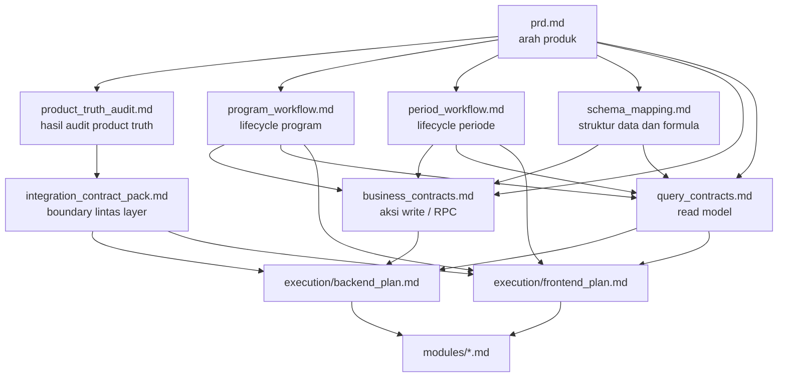
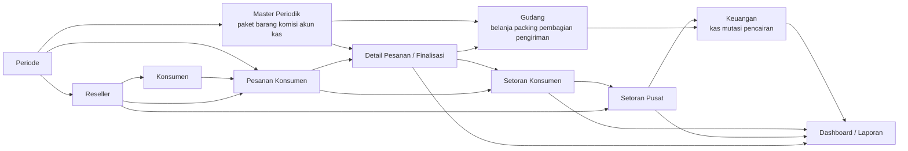
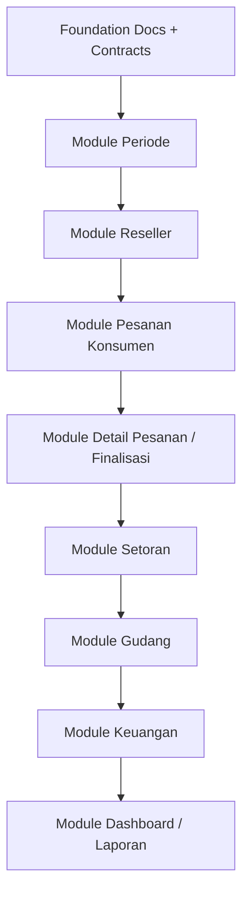
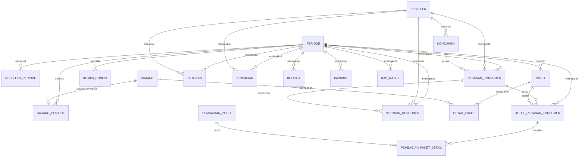
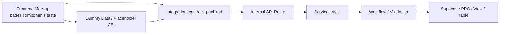

# System Maps
## Paket Lebaran Mumpuni

Dokumen ini menyediakan peta hubungan antar dokumen, modul bisnis, dan entitas data utama proyek.

Tujuannya:

- memberi peta hubungan antar dokumen inti
- memberi peta hubungan antar modul bisnis utama
- memberi peta dependency antar entitas data inti
- membantu AI coding agent memahami konteks tanpa membaca semua file dari nol

Dokumen ini bukan kontrak bisnis baru. Semua keputusan domain tetap tunduk pada dokumen product truth.

Dokumen acuan utama:

- `docs/prd.md`
- `docs/product_truth_audit.md`
- `docs/program_workflow.md`
- `docs/period_workflow.md`
- `docs/schema_mapping.md`
- `docs/business_contracts.md`
- `docs/query_contracts.md`
- `docs/integration_contract_pack.md`
- `docs/support/decision_log.md`
- `docs/support/open_questions_register.md`
- `docs/testing_strategy.md`
- `docs/execution/frontend_plan.md`
- `docs/execution/backend_plan.md`

---

## 1. Cara Membaca Peta Ini

Urutan bacaan yang disarankan untuk AI coding agent:

1. baca `prd.md` untuk arah produk
2. baca `product_truth_audit.md` untuk keputusan aman dan gap aktif
3. lihat peta dokumen pada dokumen ini
4. lihat peta modul bisnis pada dokumen ini
5. lihat peta entitas data pada dokumen ini
6. baru masuk ke execution blueprint atau blueprint modul

---

## 2. Peta Otoritas Dokumen

### Ringkasan Makna

- `prd.md` tetap menjadi pintu masuk produk
- `product_truth_audit.md` adalah filter aman sebelum agent menafsirkan kontrak lain
- `schema_mapping.md`, `business_contracts.md`, dan `query_contracts.md` adalah trio inti domain build
- `integration_contract_pack.md` adalah pagar teknis sebelum frontend dan backend berjalan paralel
- dokumen di `modules/*.md` tidak boleh membuat keputusan domain baru yang melawan dokumen di atasnya

---

## 3. Peta Peran Dokumen

| Dokumen | Peran utama | Dipakai oleh |
|---|---|---|
| `prd.md` | arah produk dan ruang lingkup | semua agent |
| `product_truth_audit.md` | audit, gap, risiko salah tafsir | semua agent |
| `program_workflow.md` | lifecycle `pesanan_konsumen`, `detail_pesanan_konsumen`, dan finalisasi pesanan | frontend, backend |
| `period_workflow.md` | lifecycle periode aktif dan penutupan | frontend, backend |
| `schema_mapping.md` | tabel, relasi, formula, constraint | backend, reviewer data |
| `business_contracts.md` | kontrak RPC/action write | backend, integrator |
| `query_contracts.md` | kontrak view/read model | frontend, backend |
| `integration_contract_pack.md` | shape payload, enum, envelope, error code | frontend, backend |
| `support/decision_log.md` | keputusan lintas-dokumen yang sudah dikunci | orchestrator, implementer |
| `support/open_questions_register.md` | pertanyaan terbuka yang tidak boleh ditebak diam-diam | orchestrator, implementer |
| `testing_strategy.md` | pagar verifikasi per modul dan per layer | implementer, reviewer |
| `execution/frontend_plan.md` | blueprint UI mockup | frontend agent |
| `execution/backend_plan.md` | blueprint engine/core logic | backend agent |
| `execution/roadmap.md` | urutan eksekusi lintas area | orchestrator |
| `modules/*.md` | blueprint modul prioritas | implementer modul |

---

## 4. Peta Modul Bisnis

### Urutan Ketergantungan Nyata

1. `periode` adalah gerbang semua modul operasional
2. `reseller` dan `master periodik` harus cukup siap sebelum volume transaksi naik
3. `pesanan konsumen` adalah titik masuk operasional reseller
4. detail pesanan dan finalisasi tidak berdiri sendiri; keduanya bergantung pada pesanan konsumen dan master periode
5. `setoran konsumen` dan `setoran pusat` membentuk dua layer pelunasan
6. `gudang` bergantung pada order aktif dan master barang/paket
7. `keuangan` bergantung pada setoran, kas, gudang, dan pencairan
8. `dashboard/laporan` datang paling akhir karena bergantung pada semua read model inti

---

## 5. Peta Modul Implementasi

### Implikasi untuk Eksekusi

- blueprint modul tidak perlu dibuat semuanya sekaligus
- rantai modul prioritas sekarang sudah lengkap dari `periode` sampai `dashboard/laporan`
- fokus berikutnya yang paling alami adalah eksekusi implementasi dan sinkronisasi read model
- `pesanan`, `detail/finalisasi`, dan `setoran` sebaiknya dipandang sebagai rantai kerja, bukan tiga pulau terpisah

Blueprint modul aktif saat ini:

- `modules/auth.md`
- `modules/master_periodik.md`
- `modules/periode.md`
- `modules/reseller.md`
- `modules/program_order.md`
- `modules/setoran.md`
- `modules/gudang.md`
- `modules/keuangan.md`
- `modules/dashboard_laporan.md`

---

## 6. Peta Entitas Data Inti

### Makna Praktis untuk Agent

- `pesanan_konsumen` adalah parent operasional untuk tagihan/cicilan konsumen
- `detail_pesanan_konsumen` adalah daftar item paket di dalam pesanan
- `setoran_konsumen` harus selalu bisa dilacak ke `pesanan_konsumen`, `reseller`, dan `periode`
- `setoran` layer pusat harus selalu bisa dilacak ke `reseller` dan `periode`
- data gudang dan keuangan tidak boleh lepas dari konteks `periode`

---

## 7. Peta Boundary Frontend dan Backend

### Aturan Boundary

- frontend hanya boleh bicara dalam shape kontrak yang sama
- placeholder API harus meniru envelope yang nanti dipakai route internal
- service layer tidak boleh bocor langsung ke UI
- business validation final tetap hidup di workflow / SQL boundary

---

## 8. Peta Dependency per Workstream

| Workstream | Bergantung pada | Menjadi fondasi untuk |
|---|---|---|
| `periode` | product truth + kontrak status | semua modul operasional |
| `reseller` | periode + auth/profile | konsumen, pesanan, setoran |
| `pesanan_konsumen` | periode + reseller + konsumen | detail item, setoran konsumen |
| `detail_pesanan_konsumen` | pesanan + paket periode | gudang, laporan, komisi |
| `setoran_konsumen` | pesanan + reseller + periode | status lunas konsumen, saldo reseller |
| `setoran` | reseller + periode + saldo terkumpul | status lunas reseller, kas |
| `gudang` | detail pesanan aktif/final + paket + barang periode | pengiriman, laporan stok |
| `keuangan` | setoran + gudang + kas masuk | pencairan, saldo, laporan |
| `laporan` | semua read model inti | dashboard dan audit operasional |

---

## 9. Rule Graphify untuk AI Coding Agent

Saat agent menerima task baru, lakukan cek cepat:

1. task ini berada di modul apa
2. modul itu bergantung pada modul mana
3. dokumen otoritatif apa yang harus dibaca dulu
4. entity apa yang menjadi pusat perubahan
5. apakah task menyentuh boundary frontend, backend, atau keduanya

Checklist minimum:

- jika task menyentuh status, cek workflow domain lebih dulu
- jika task menyentuh payload, cek `integration_contract_pack.md`
- jika task menyentuh formula, cek `schema_mapping.md` dan `query_contracts.md`
- jika task menyentuh write action, cek `business_contracts.md`
- jika task menyentuh modul prioritas, cek juga dokumen yang relevan di `modules/`

---

## 10. Catatan Arsitektur

Dokumen ini menetapkan:

- `support/system_maps.md` menjadi index visual utama untuk hubungan antar dokumen, modul, dan entitas
- `data_flow.md` tetap fokus ke alur operasional bisnis
- semua blueprint modul berikutnya sebaiknya menaut ke dokumen ini agar agent baru cepat orientasi

---

## 11. Catatan Penggunaan

Saat menggunakan dokumen ini:

1. baca peta otoritas dokumen untuk orientasi lintas layer
2. baca peta modul bisnis untuk memahami ketergantungan antar modul
3. baca peta entitas data untuk memahami relasi data inti
4. baru masuk ke blueprint modul atau execution plan yang relevan
